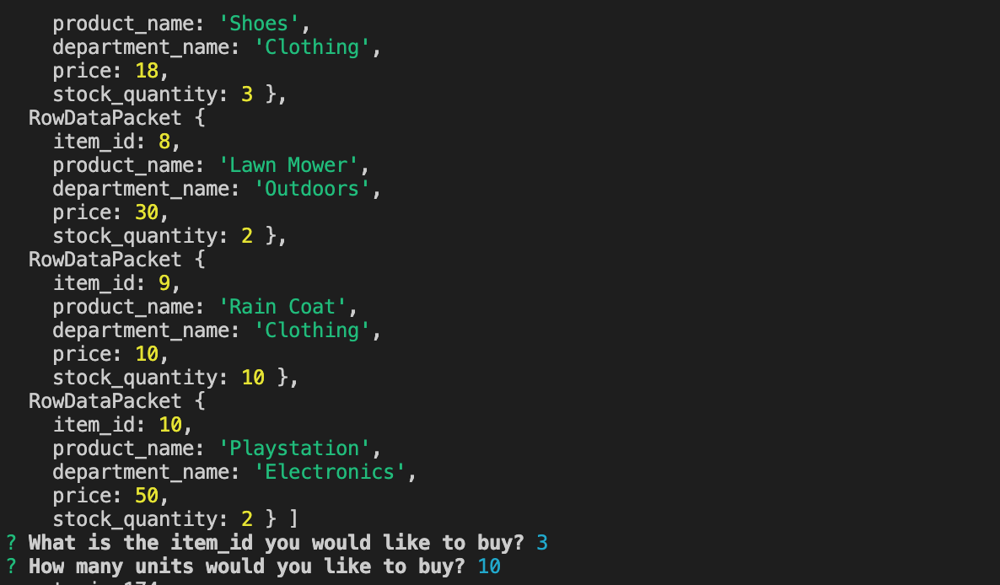
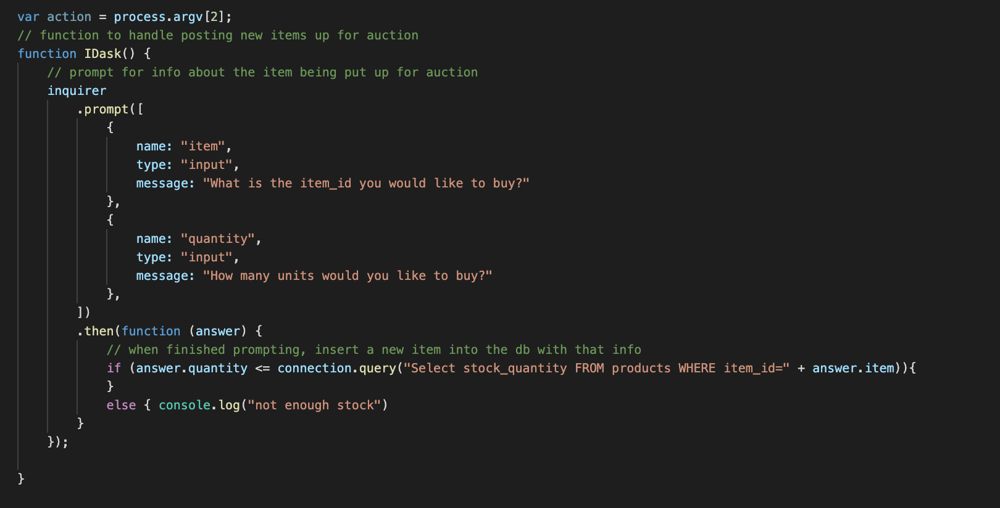

# bamazon

Functionality and purpose: 

Able to sort through a database seeded with products containing the price, name, an quantity of the item in stock. The user is able to 'purchase' an item by querying the databse with the item ID and checking to see if there is enough stock. 

